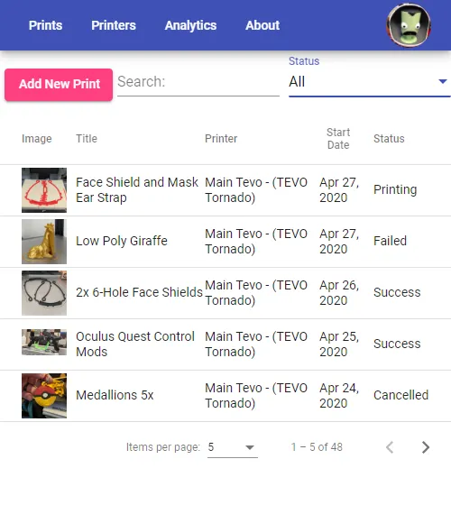
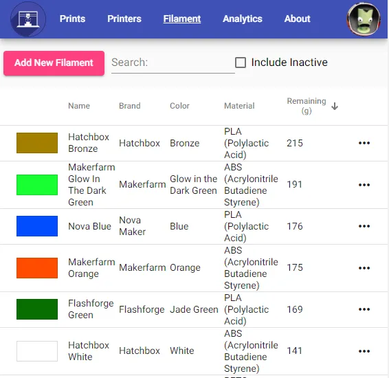
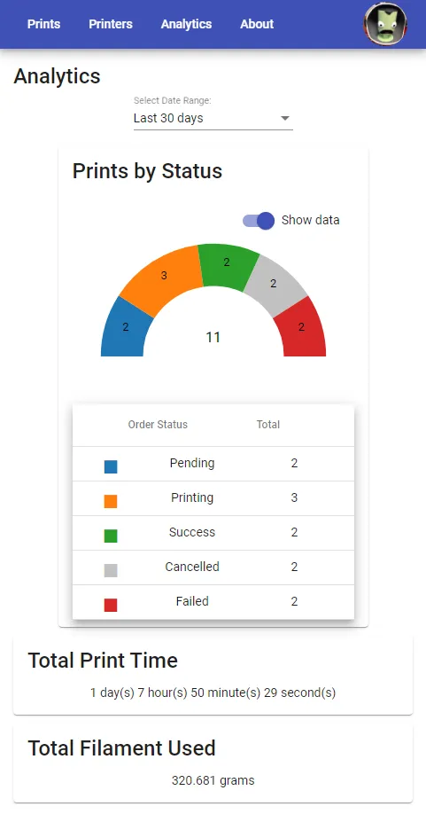

<p align="center">
  
</p>

[](https://github.com/HoffmanEngineering/3d-print-log-ui/actions/workflows/ci.yml)
[](https://www.gnu.org/licenses/agpl-3.0)

The frontend for [3D Print Log](https://3dprintlog.com) — a web application for tracking 3D prints, printers, and filaments.

**Live app:** https://3dprintlog.com

<table align="center"><tr>
  <td></td>
  <td></td>
  <td></td>
</tr></table>

## Features

- Log prints with photos, notes, slicer settings, filament usage, and per-print cost tracking
- Direct slicer plugins for Cura and Slic3r-based slicers (OrcaSlicer, PrusaSlicer, Bambu Studio, and more) — log prints straight from your slicer without manual G-code uploads
- Direct integration with OctoPrint and Klipper/Moonraker for automatic print tracking
- Manage printers and track maintenance history
- Manage material inventory (filament, resin, and more) with usage and remaining quantity tracking, and QR code labels for quick spool lookup
- View analytics and statistics across your print history
- Share prints on a public feed
- Integrate with external tools via API keys

## Getting Started

See [CONTRIBUTING.md](CONTRIBUTING.md) for local setup, configuration, and running tests.

## Tech Stack

- Angular 21 (with static prerendering/SSG of marketing routes via `@angular/ssr`)
- Angular Material
- Auth0 SPA SDK
- Azure Static Web Apps

## Infrastructure

The production environment runs on Azure (Static Web Apps for the frontend). It is manually managed — there is no infrastructure-as-code in this repo. PRs that require infrastructure changes (new environment variables, auth configuration, hosting config) should call that out explicitly in the PR description.

The `sitemap.xml` is generated at deploy time from the public API (`scripts/generate-sitemap.mjs`) and shipped with the prebuilt output; a scheduled workflow refreshes it daily from the latest release tag.

## Generated Assets

The home page's feature screenshots are produced by driving the real app against fixture data in Cypress, not captured by hand. **No workflow runs this** — the images are committed WebP under `src/assets/`, so they stay as they are until someone re-runs the capture and commits the result:

```bash
npm run capture:home:all
```

Re-run it after changing the print list, the materials list, or the analytics overview tab; nothing compares the committed images against the current UI, so they go stale silently. See [cypress/CLAUDE.md](cypress/CLAUDE.md) for how it works.

## Related Repos

- [3d-print-log-api](https://github.com/HoffmanEngineering/3d-print-log-api) — the backend API
- [3d-print-log-app](https://github.com/HoffmanEngineering/3d-print-log-app) — Cordova Android app shell
- [3d-print-log-cura-plugin](https://github.com/HoffmanEngineering/3d-print-log-cura-plugin) — Cura integration
- [Slic3rPostProcessingUploader](https://github.com/HoffmanEngineering/Slic3rPostProcessingUploader) — PrusaSlicer, OrcaSlicer, Bambu Studio and Slic3r integration

## Questions & Discussions

[**Discussions**](https://github.com/HoffmanEngineering/3d-print-log-ui/discussions) is the front door for the whole project, not just this repository. Ask in [Q&A](https://github.com/HoffmanEngineering/3d-print-log-ui/discussions/categories/q-a) if you have a usage question about the web app, the API, or either slicer plugin — one board means you do not have to guess which repository a question belongs to, and answers stay searchable for whoever asks next.

Bug reports and feature requests still belong in [issues](https://github.com/HoffmanEngineering/3d-print-log-ui/issues), on whichever repository they affect.

## Support Development

If you find 3D Print Log useful, consider supporting its development:

- [**Subscribe to Pro**](https://3dprintlog.com/subscription) for an ad-free experience and extra cloud storage
- [**Donate via PayPal**](https://paypal.me/hoffmanengineering) to buy me a coffee
- [**Become a Patron**](https://www.patreon.com/HoffmanEngineering) on Patreon

## License

[GNU Affero General Public License v3.0](LICENSE)
